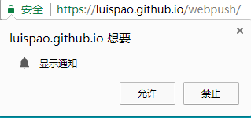

web push

- 推送的价值
  - 客户端消息推送对于提升用户体验有很重要作用，我们可以想象1个场景，譬如你用某抢票软件，假如你没有预付，那么抢到后它及时通知你就非常有价值；另外还有到货通知等。这种类型的通知个性化的，一般有电话，短信，或者客户端的推送几种方式选择。对客户端推送更常见的场景就是新闻资讯类的应用，根据用户的订阅或浏览记录，给用户不定时推送一些ta感兴趣的内容，一方面服务了用户，另一方面从运营来说，可以提升了留存，日活，月活。

- PWA带来的web push
  - 我们以往所接收客户端推送基本就只停留在原生应用，虽然我们依旧在移动互联网浪潮里面，但是还是有一部分用户选择浏览器来满足他们的需求。对于web开发人员来说，Google这两年一直在推的PWA，让我们看看了“web一统天下”的一丝丝曙光，但这个信念的落地现在还为时尚早，或者永远都不可能。不过我们更该关注的是PWA到底带来了什么新的标准，让我们可以更好的服务用户。其中web push就是PWA带来的一个重要的特性，让使用浏览器的用户也能享受到推送的服务。
  - PWA现在推的进展如何？我们知道上个月（2017-12）苹果的桌面版 Safari 46 preview 支持了service worker，本月 IOS11.3 也跟上了PC的节奏。首先，service worker是支持web push最基础的功能，其次，我们看到苹果也有心参与到PWA的建设工作中。

- 实现

  web push最新标准和具体实现有很多内容可以分享，所以我将分多篇文章来展开。内容主要参照Google web fundamentals，经由笔者的理解并归纳，倘若更新不及时或者有偏差，请以Google web fundamentals为准。

  - 鸟瞰

    在深入剖析之前，我们需要对整个Push过程有个概览，这里面会牵涉到相关的web APIs或一些从未接触的概念，此篇先简单带过，后续会对重要的概念进一步介绍。

    实现Push的过程主要三个关键的点：1）客户端订阅推送服务、2）服务端触发推送、3）客户端展示推送内容。

    - Step 1

      订阅推送

      首先，要获取当前用户浏览器在当前应用域名下**通知**的 **permission** ，我们最常见的是获取用户地理信息的 permission ，获取通知 permission 也类型，通过<u>Pemission APIs</u> 在特定时机以最佳的策略弹出弹窗供用户选择。这是至关重要的一步，我们要想方设法让用户只会点”允许“的按钮。

      

      接着，假设浏览器已经支持 <u>Service Worker</u> 和 <u>Push APIs</u> ， 那我们要通过注册 Service Worker 文件并通过 Push APIs 获取到 **PushSubscription** （后简写：PushSub）。   PushSub 是一个Object ，也属于 Push APIs ，里面包含了当前用户的信息，需要交由服务端来保存管理，服务端触发推送要依赖 PushSub 才能推送给目标用户。

      我们可以把 PushSub 理解为用户在当前浏览器当前应用域名下的 id ，那它到底是怎么生成的？想实现标准的 web push ，应用需要有一对Keys，称为 **application server keys**，服务端保留 private key ，客户端在订阅推送服务调用 Push API 的时候需要用到 public key ， promise-based 的 Push API 就会拿到 PushSub 。这里得先引入另外一个概念： **Push Service** ，在生成 PushSub 过程中，是得依赖于 Push Service ，它可以是浏览器厂商自己搭建的，也可以由第三方提供。 Push Service 拿到应用的 public key ，返回给浏览器 PushSub ，服务端再保存。

    - step 2

      触发推送

      我们先来看看服务端保存的 PushSub 长什么样

      ```json
      {
        "endpoint": "https://random-push-service.com/some-kind-of-unique-id-1234/v2/",
        "keys": {
          "p256dh" : "BNcRdreALRFXTkOOUHK1EtK2wtaz5Ry4YfYCA_0QTpQtUbVlUls0VJXg7A8u-Ts1XbjhazAkj7I99e8QcYP7DkM=",
          "auth"   : "tBHItJI5svbpez7KI4CCXg=="
        }
      }
      ```

      endpoint 就是一个 URL ，域名  “random-push-service.com” 就是 Push Service

    ​

  ​